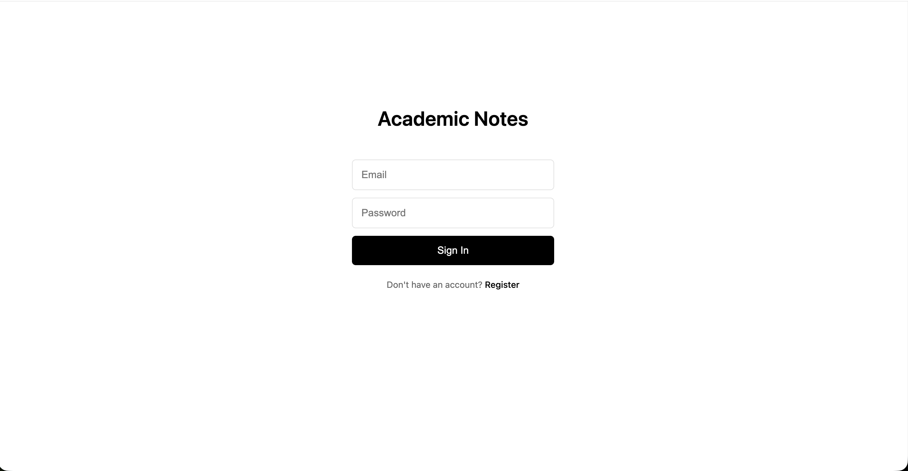
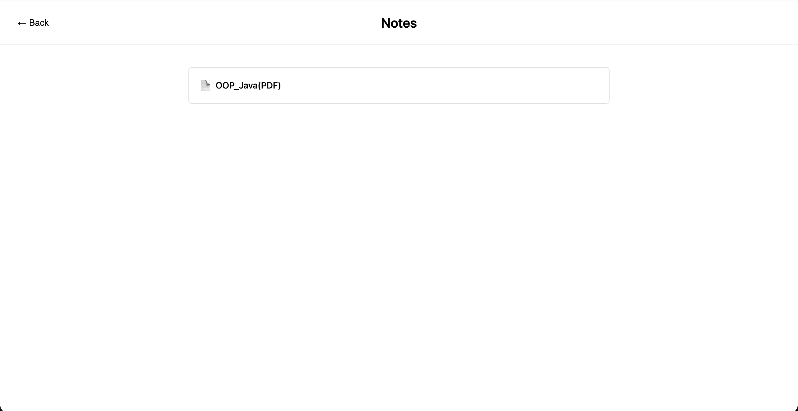
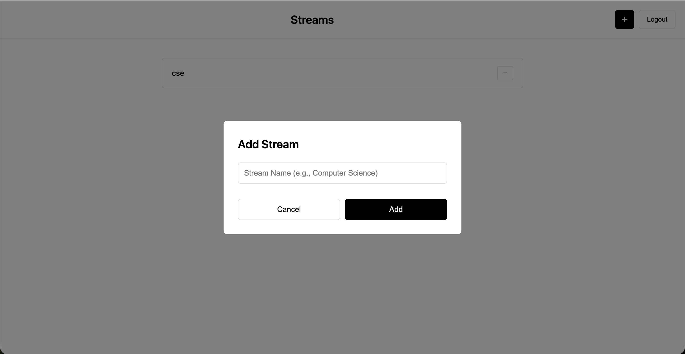
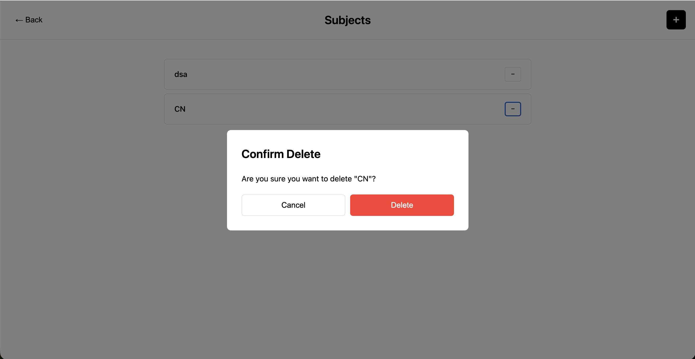
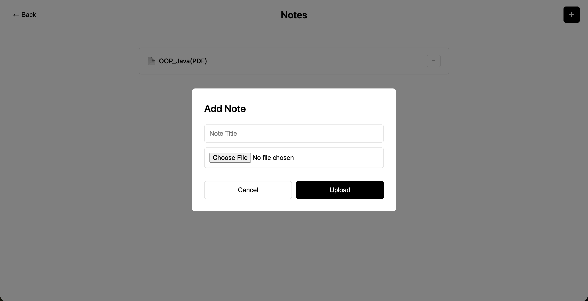
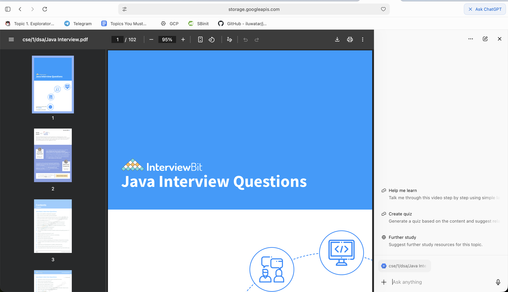

# 📚 Academic Notes Management System

A comprehensive Spring Boot REST API for managing academic notes with a hierarchical structure: **Stream → Semester → Subject → Note**. Features include JWT authentication, role-based access control, and Google Cloud Storage integration for PDF file management.
[Live_Link_click](http://34.123.177.252:8080)
- Login Image and user pages


- Admin pages add,delete sem-streams and subject also add files and delete files!




## 🌟 Features

- **Hierarchical Structure**: Organize notes by Stream (CSE, ECE, etc.) → Semester (1-8) → Subject → Individual Notes
- **JWT Authentication**: Secure token-based authentication with role-based access control
- **Role-Based Authorization**: 
  - `ADMIN`: Full CRUD operations
  - `USER`: Read-only access
- **Google Cloud Storage**: Automated PDF file uploads with signed URLs
- **RESTful API**: 16 well-documented endpoints for complete CRUD operations
- **MySQL Database**: Persistent storage with JPA/Hibernate
- **URL Encoding**: Proper handling of file paths with spaces and special characters

## 🏗️ Architecture

```
Stream (e.g., CSE, ECE)
  └── Semester (1-8)
      └── Subject (e.g., Data Structures)
          └── Note (PDF files with titles)
```

**Example GCS Path**: `notes-pdfs/CSE/3/Data Structures/lecture.pdf`

## 🛠️ Tech Stack

- **Framework**: Spring Boot 3.3.4
- **Language**: Java 21
- **Database**: MySQL 8.0+
- **Cloud Storage**: Google Cloud Storage
- **Security**: Spring Security + JWT (HS256)
- **Build Tool**: Maven
- **ORM**: JPA/Hibernate

## 📋 Prerequisites

- Java 21+
- Maven 3.6+
- MySQL 8.0+
- Google Cloud Platform account with Cloud Storage enabled
- GCS Service Account JSON key file

## 🚀 Getting Started

### 1. Clone the Repository

```bash
git clone https://github.com/subramanya-44/unifeed.git
cd unifeed
```

### 2. Configure MySQL Database

Create a database:

```sql
CREATE DATABASE notes_db;
```

### 3. Update Application Properties

Edit `src/main/resources/application.properties`:

```properties
# MySQL Configuration
spring.datasource.url=jdbc:mysql://localhost:3306/notes_db
spring.datasource.username=your_mysql_username
spring.datasource.password=your_mysql_password

# JWT Configuration
jwt.secret=your-256-bit-secret-key-here-must-be-at-least-32-chars-long
jwt.expiration=1800000

# GCS Configuration
gcs.bucket.name=your-gcs-bucket-name
gcs.credentials.location=path/to/your-service-account-key.json
```

### 4. Set Up Google Cloud Storage

1. Create a GCS bucket (e.g., `notes-pdfs`)
2. Create a service account with Storage Object Admin role
3. Download the JSON key file
4. Place it in your project root (it's already in `.gitignore`)

### 5. Build and Run

```bash
# Build the project
mvn clean install

# Run the application
mvn spring-boot:run
```

The application will start on `http://localhost:8080`

## 🔑 Default Credentials

The system comes with two pre-configured users:

| Email | Password | Role |
|-------|----------|------|
| check_code | 1234 | ADMIN |
| user@example.com | 1234 | USER |

⚠️ **Important**: Change these credentials before deploying to production!

## 📡 API Endpoints

### Authentication

| Method | Endpoint | Description | Access |
|--------|----------|-------------|--------|
| POST | `/auth/login` | Login and get JWT token | Public |

### Streams

| Method | Endpoint | Description | Access |
|--------|----------|-------------|--------|
| GET | `/streams` | Get all streams | USER, ADMIN |
| POST | `/streams` | Create a stream | ADMIN |
| GET | `/streams/{id}` | Get stream by ID | USER, ADMIN |
| DELETE | `/streams/{id}` | Delete a stream | ADMIN |

### Semesters

| Method | Endpoint | Description | Access |
|--------|----------|-------------|--------|
| GET | `/streams/{streamId}/semesters` | Get semesters for a stream | USER, ADMIN |
| POST | `/streams/{streamId}/semesters` | Create a semester | ADMIN |
| GET | `/semesters/{id}` | Get semester by ID | USER, ADMIN |
| DELETE | `/semesters/{id}` | Delete a semester | ADMIN |

### Subjects

| Method | Endpoint | Description | Access |
|--------|----------|-------------|--------|
| GET | `/semesters/{semesterId}/subjects` | Get subjects for a semester | USER, ADMIN |
| POST | `/semesters/{semesterId}/subjects` | Create a subject | ADMIN |
| GET | `/subjects/{id}` | Get subject by ID | USER, ADMIN |
| DELETE | `/subjects/{id}` | Delete a subject | ADMIN |

### Notes

| Method | Endpoint | Description | Access |
|--------|----------|-------------|--------|
| GET | `/subjects/{subjectId}/notes` | Get notes for a subject | USER, ADMIN |
| POST | `/subjects/{subjectId}/notes` | Upload a note (multipart/form-data) | ADMIN |
| GET | `/notes/{id}` | Get note by ID | USER, ADMIN |
| DELETE | `/notes/{id}` | Delete a note | ADMIN |

## 🧪 API Examples

### 1. Login

```bash
curl -X POST http://localhost:8080/auth/login \
  -H "Content-Type: application/json" \
  -d '{
    "email": "admin@example.com",
    "password": "1234"
  }'
```

**Response:**
```json
{
  "accessToken": "eyJhbGciOiJIUzI1NiJ9...",
  "expiresIn": 1800000,
  "role": "ADMIN"
}
```

### 2. Create a Stream

```bash
curl -X POST http://localhost:8080/streams \
  -H "Authorization: Bearer YOUR_TOKEN" \
  -H "Content-Type: application/json" \
  -d '{"name": "Computer Science Engineering"}'
```

### 3. Create a Semester

```bash
curl -X POST http://localhost:8080/streams/1/semesters \
  -H "Authorization: Bearer YOUR_TOKEN" \
  -H "Content-Type: application/json" \
  -d '{"number": 3}'
```

### 4. Create a Subject

```bash
curl -X POST http://localhost:8080/semesters/1/subjects \
  -H "Authorization: Bearer YOUR_TOKEN" \
  -H "Content-Type: application/json" \
  -d '{"name": "Data Structures and Algorithms"}'
```

### 5. Upload a Note (PDF)

```bash
curl -X POST http://localhost:8080/subjects/1/notes \
  -H "Authorization: Bearer YOUR_TOKEN" \
  -F "title=Lecture 1 - Introduction" \
  -F "file=@/path/to/your/lecture.pdf"
```

**Response:**
```json
{
  "id": "550e8400-e29b-41d4-a716-446655440000",
  "title": "Lecture 1 - Introduction",
  "fileUrl": "https://storage.googleapis.com/notes-pdfs/CSE%2F3%2FData%20Structures%2Flecture.pdf",
  "subjectId": 1,
  "subjectName": "Data Structures and Algorithms"
}
```

### 6. Get All Notes for a Subject

```bash
curl http://localhost:8080/subjects/1/notes \
  -H "Authorization: Bearer YOUR_TOKEN"
```

📖 **For more examples**, see [API-COMPLETE-GUIDE.md](API-COMPLETE-GUIDE.md)

## 📁 Project Structure

```
src/main/java/com/app/notes/
├── config/              # Security and JWT configuration
│   ├── JwtFilter.java
│   ├── JwtUtil.java
│   └── SecurityConfig.java
├── controller/          # REST API endpoints
│   ├── AuthController.java
│   ├── NoteController.java
│   ├── StreamController.java
│   ├── SemesterController.java
│   └── SubjectController.java
├── dto/                 # Data Transfer Objects
│   ├── AuthResponse.java
│   ├── LoginRequest.java
│   ├── NoteRequest.java
│   └── NoteResponse.java
├── model/              # JPA Entities
│   ├── Note.java
│   ├── Stream.java
│   ├── Semester.java
│   └── Subject.java
├── repository/         # JPA Repositories
│   ├── NoteRepository.java
│   ├── StreamRepository.java
│   ├── SemesterRepository.java
│   └── SubjectRepository.java
├── service/            # Business Logic
│   ├── AuthService.java
│   ├── NoteService.java
│   ├── StreamService.java
│   ├── SemesterService.java
│   ├── SubjectService.java
│   └── StorageService.java
└── NotesApplication.java
```

## 🔒 Security

- **JWT Tokens**: 30-minute expiration (configurable)
- **Password Storage**: Passwords are hardcoded in `AuthService` (update for production!)
- **Role-Based Access**: Spring Security with method-level authorization
- **CORS**: Configure for your frontend origin in production
- **Sensitive Files**: Excluded via `.gitignore`

## 🐛 Troubleshooting

### Port Already in Use

```bash
# Find process on port 8080
lsof -i :8080

# Kill the process
kill -9 <PID>
```

### JWT Token Expired

Tokens expire after 30 minutes. Request a new token via `/auth/login`.

### GCS Upload Fails

- Verify service account has Storage Object Admin role
- Check bucket name in `application.properties`
- Ensure JSON key file path is correct

### Database Connection Error

- Verify MySQL is running
- Check database credentials in `application.properties`
- Ensure `notes_db` database exists

## 🚀 Deployment

### Production Checklist

- [ ] Update database credentials
- [ ] Replace hardcoded users with database authentication
- [ ] Configure CORS for frontend origin
- [ ] Use environment variables for sensitive data
- [ ] Enable HTTPS
- [ ] Update JWT secret key (use environment variable)
- [ ] Set up proper logging
- [ ] Configure GCS with production bucket
- [ ] Set up CI/CD pipeline

### Environment Variables Example

```bash
export DB_URL=jdbc:mysql://production-db:3306/notes_db
export DB_USERNAME=prod_user
export DB_PASSWORD=secure_password
export JWT_SECRET=your-production-secret-key-here
export GCS_BUCKET=production-notes-bucket
export GCS_CREDENTIALS=/path/to/prod-key.json
```

## 📄 License

This project is open source and available under the [MIT License](LICENSE).

## 👨‍💻 Author

**Subramanya T N**
- GitHub: [@subramanya-44](https://github.com/subramanya-44)
- Repository: [unifeed](https://github.com/subramanya-44/unifeed)

## 🤝 Contributing

1. Fork the repository
2. Create a feature branch (`git checkout -b feature/amazing-feature`)
3. Commit your changes (`git commit -m 'Add amazing feature'`)
4. Push to the branch (`git push origin feature/amazing-feature`)
5. Open a Pull Request

## 📝 Future Enhancements

- [ ] User registration endpoint
- [ ] Email verification
- [ ] Password reset functionality
- [ ] File deletion from GCS when deleting notes
- [ ] Cascade delete for hierarchical entities
- [ ] Pagination for large result sets
- [ ] Search and filter endpoints
- [ ] File type validation (PDF only)
- [ ] File size limits
- [ ] Rate limiting
- [ ] API documentation with Swagger/OpenAPI
- [ ] Unit and integration tests
- [ ] Docker containerization
- [ ] Kubernetes deployment configs

## 📞 Support

If you encounter any issues or have questions:

1. Check the [API-COMPLETE-GUIDE.md](API-COMPLETE-GUIDE.md)
2. Review the troubleshooting section above
3. Open an issue on GitHub

---

⭐ If you find this project helpful, please give it a star!
# SpringBoot_Notes_App
